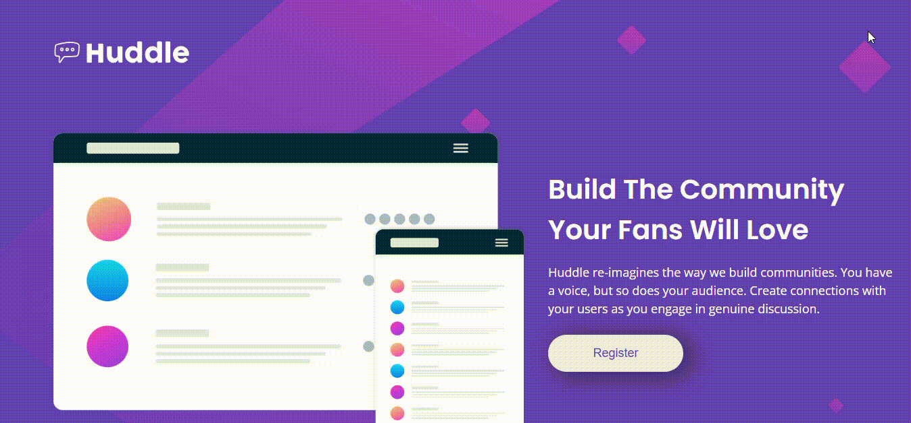
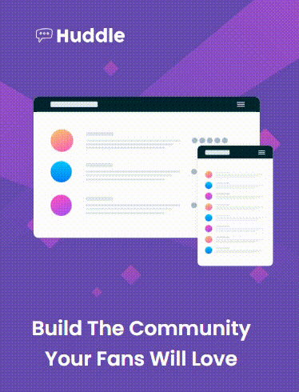

## Projeto HTML Avançado e CSS Avançado do curso Dev Quest. 

Lane page foi criada utilizando conhecimentos de HTML avançado e CSS avançado. Com design base web e responsiva fornecidos pelo Frontend Mentor.

Unidade utilizada para responsivo foi baseada em design base de 375px para visualização em aparelhos celulares. 

## Tecnologias Utilizadas

- HTML
- CSS
